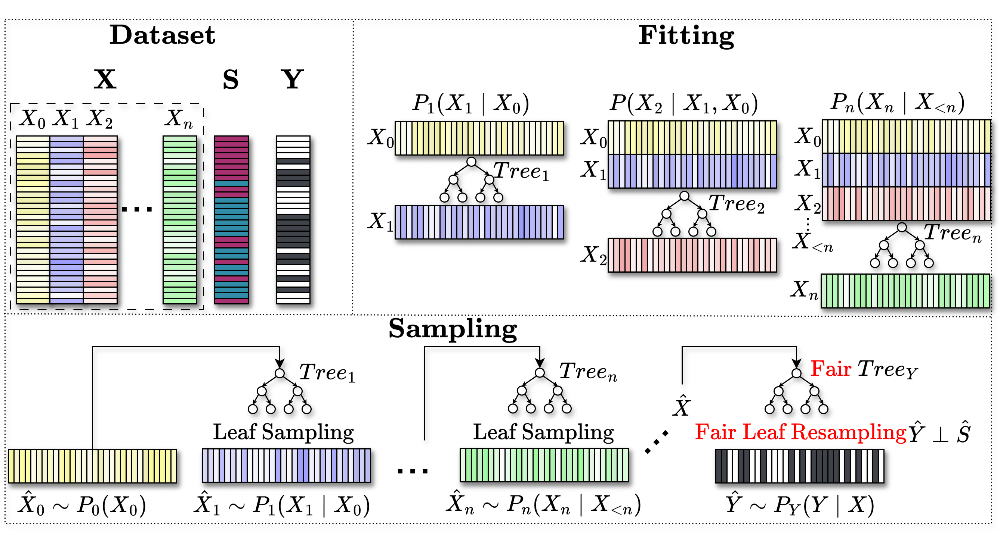
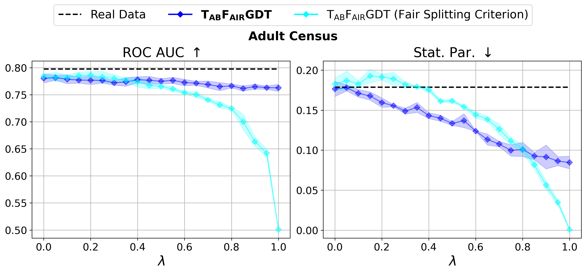

# TABFAIRGDT: A Fast Fair Tabular Data Generator using Autoregressive Decision Trees

<figure style="background-color: white; padding: 10px; display: inline-block;width: 60%;">
  
  <figcaption style="color: black;">Figure 1: Overview of TABFAIRGDT</figcaption>
</figure>


### Installation Instructions

Create new conda environment e.g.
```
conda create --name tabfairgdt python=3.10
```
Install packages 
```
pip install synthcity
pip install atom-ml[full]
```
```
pip install -r requirements.txt
```
Install "our" tabfairgdt package

```
cd tabfairgdt_src
pip install -e .
```


### Usage 

Everything is executed using the `main.py` file.

The command is
```
python main.py --dataset dataset_name --methods tabfairgdt tabular_argn tab_fair_gan cuts fsmote prefair --mode run
```
Check main.py for all default arguments

To plot the results in `/plots` after an experiment is finished change the argument `--mode plot`.


---

### Optional installation Instructions

(Optional) Install MostylAI-engine (for competitor TabularARGN)

```
cd competitors/TabularARGN/mostlyai_engine/
pip install -e .
```
---

(Optional) Install custom scikit learn package (fair splitting criterion experiment)

This contains the "fair" decission trees (fair splitting criterion implementation) by FARE (https://github.com/eth-sri/fare).

```
cd scikit-learn-main 
pip install --editable . \
   --verbose --no-build-isolation \
   --config-settings editable-verbose=true
```

However, this is not recomended, as this approach leads to loss in utility
<figure style="background-color: white; padding: 10px; display: inline-block;width: 50%;">
  
  <figcaption style="color: black;">Figure 2: TABFAIRGDT vs TABFAIRGDT (fair splitting criterion)</figcaption>
</figure>

---

### References

"[TABFAIRGDT: A Fast Fair Tabular Data Generator using Autoregressive Decision Trees][1]", Emmanouil Panagiotou, Benoît Ronval, Arjun Roy, Ludwig Bothmann, Bernd Bischl, Siegfried Nijssen, and Eirini Ntoutsi, IEEE International Conference on Data Mining (ICDM), 2025

Contact: Emmanouil Panagiotou (emmanouil.panagiotou@fu-berlin.de), Benoît Ronval (benoit.ronval@uclouvain.be)

[1]:<https://arxiv.org/abs/2509.19927>

---